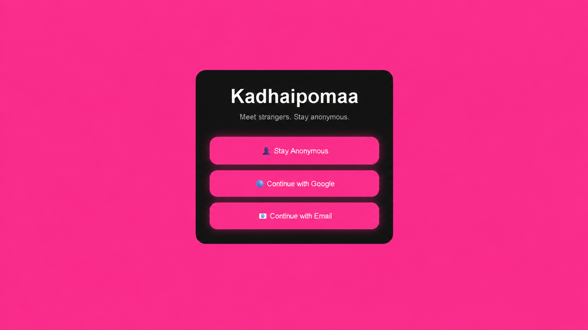
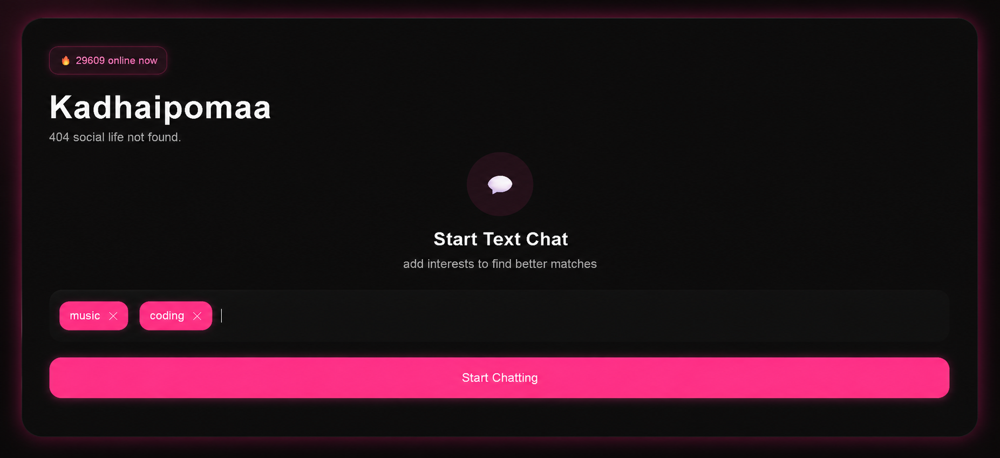
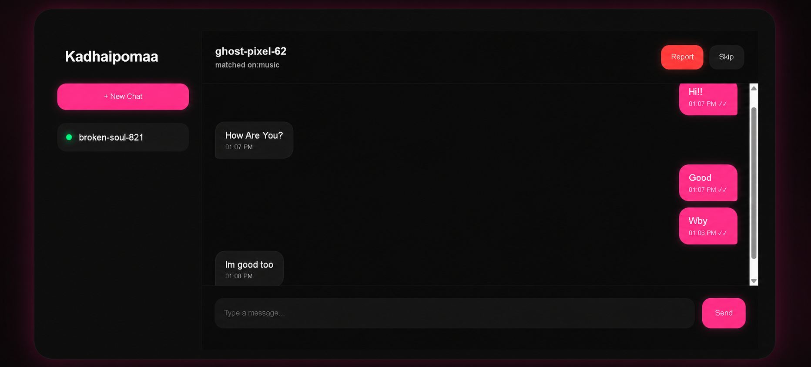
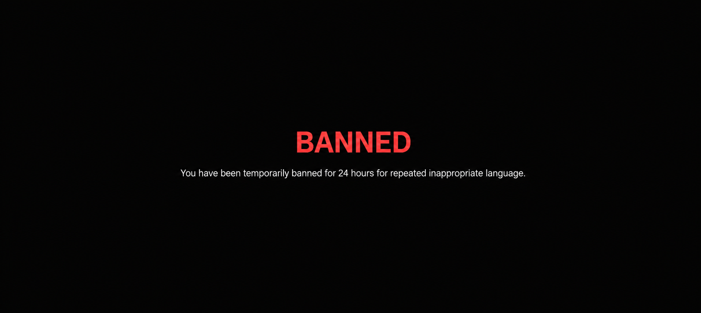

# Kadhaipomaa - Frontend

Kadhaipomaa is a fast, anonymous, real-time chat application built with React. Meet new people, chat safely, and connect over shared interests!

## Live Demo
👉 **[https://kadhaipomaa-frontend.vercel.app](https://kadhaipomaa-frontend.vercel.app)**

## Features
- **Anonymous Chatting:** Instantly connect with strangers.
- **Interest Matching:** Filter connections based on shared hobbies and topics.
- **Beautiful UI:** A modern, glassmorphic dark-mode design with glowing aesthetics.
- **Admin Dashboard:** A secure panel (`/admin`) for site owners to monitor active connections and manage IP bans.

## Technologies Used
- **Frontend Framework:** React.js
- **Routing:** Built-in SPA conditional routing (Vercel rewrite optimized)
- **WebSockets:** Socket.io-client for real-time communication
- **Styling:** Custom Vanilla CSS for rich, animated aesthetics
- **Auth:** Firebase (for optional/admin features)

## Setup Instructions

1. **Clone the repo and install dependencies:**
   ```bash
   npm install
   ```

2. **Run the local development server:**
   ```bash
   npm start
   ```
   The app will run at `http://localhost:3000`.

## Deployment
This project is optimized for deployment on **Vercel**. All SPA routing rules are pre-configured in `vercel.json` to handle React client-side paths (like the `/admin` dashboard) perfectly.

## App Showcase
Here are some previews of the core features in action. Place your screenshots in a `screenshots/` folder at the repository root and use the relative paths below.

### 1. Sign Up & Login
Users can join anonymously, or sign in securely via Email/Google.


### 2. Interest Selection
Find specific strangers by entering matching interests.


### 3. Anonymous Chat Box
Real-time text chat with typing indicators and online status.


### 4. Moderation & Ban System
Automated profanity filter and a 3-strike temporary ban to maintain a safe environment.


## How to Add/Update Screenshots
1. Create a folder named `screenshots` at the repo root if it doesn't exist.
2. Save your images as `signup.png`, `interests.png`, `chat.png`, and `ban.png` respectively.
3. Commit the images and push – the README will automatically display the new screenshots.

---

## 🛑 Copyright & Usage Restriction
© 2026 Tanishka R (Kadhaipomaa). All Rights Reserved.

This repository and its source code are provided for portfolio evaluation and recruiter review ONLY.

You are strictly prohibited from copying, cloning, modifying, distributing, or hosting this application (in whole or in part) for personal, educational, or commercial use without explicit written permission from the author.
